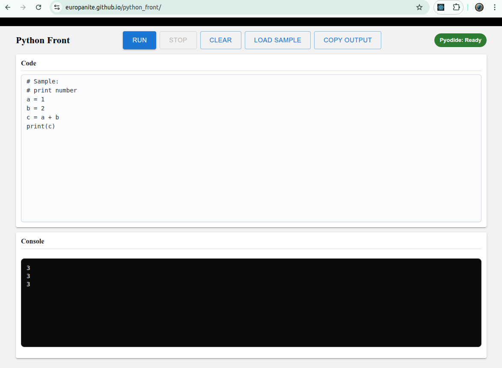

# [Client Side Python](https://github.com/europanite/client_side_python "Client Side Python")

[](https://opensource.org/licenses/Apache-2.0)

[](https://github.com/europanite/client_side_python/actions/workflows/ci.yml)
[](https://github.com/europanite/client_side_python/actions/workflows/docker.yml)
[](https://github.com/europanite/client_side_python/actions/workflows/deploy-pages.yml)


<p align="right">
  <a href="./README.md">🇺🇸 English</a> |
  <a href="./README.ja.md">🇯🇵 日本語</a> |
  <a href="./README.zh-CN.md">🇨🇳 简体中文</a> |
  <a href="./README.es.md">🇪🇸 Español</a> |
  <a href="./README.pt-BR.md">🇧🇷 Português (Brasil)</a> |
  <a href="./README.ko.md">🇰🇷 한국어</a> |
  <a href="./README.de.md">🇩🇪 Deutsch</a> |
  <a href="./README.fr.md">🇫🇷 Français</a>
</p>



 [PlayGround](https://europanite.github.io/client_side_python/)

一个基于浏览器、完全运行在客户端的 Python Playground。 

---

## 概览

Client Side Python 是一个**由 Pyodide 驱动的浏览器端 Python Playground**。  
所有 Python 代码都**完全在你的浏览器标签页中运行**（WebAssembly，无后端），因此你的代码不会离开本机。

这使它非常适合以下场景：

- 快速试验小型 Python 代码片段
- 在课堂或工作坊中演示 Python 基础
- 在安全沙箱中尝试简单的数值计算或脚本任务
- 展示 WebAssembly + Pyodide 如何将“真正的” Python 带到浏览器中

---

## 功能

- **完全客户端执行**  
  - 使用 [Pyodide](https://pyodide.org) 在 WebAssembly 中运行 CPython。
  - 默认无需服务器、数据库或身份验证。

- **简洁的代码编辑器 + 控制台**  
  - 用于编写 Python 代码的文本区域。
  - 显示 `stdout` 和 `stderr` 的控制台区域。
  - 按钮：**Run**、**Stop**、**Clear**、**Load Sample**、**Copy Output**。

- **软性“Stop”机制**  
  - 执行过程被封装在一个软取消令牌中。
  - 当你按下 **Stop** 时，当前执行会在逻辑上被取消，延迟返回的结果会被忽略，而不会破坏 UI。

- **响应式 Web UI**  
  - 使用 **Expo / React Native Web** 和 **Material UI** 组件构建。
  - 布局可适配不同视口尺寸（桌面 / 平板）。

- **通过 Docker 实现确定性的 CI**  
  - Jest 测试使用 `docker-compose.test.yml` 在 Docker 容器中运行。
  - 提供了用于 CI 和基于 Docker 测试的 GitHub Actions 工作流。

- **自动部署到 GitHub Pages**  
  - GitHub Actions 工作流会构建 Expo Web bundle，并将其发布到 `main` 分支对应的 GitHub Pages。

---

## 工作原理

应用首次加载时，会执行以下操作：

1. 从 CDN 获取 Pyodide。
2. 初始化 Pyodide 运行时，并暴露 `runPythonAsync`。
3. 挂载 `stdout` 和 `stderr` 的自定义处理器，以便将 Python 输出流式写入页面内控制台。
4. 使用简单的执行令牌实现 **soft Stop**：
   - 每次运行都会递增内部 `execId`。
   - 如果某次运行结束时对应的是过期的 `execId`，其输出将被丢弃。
   - 这样可以防止旧运行结果污染控制台。

这一切都发生在**浏览器中**，无需任何后端 API 调用。

---

## 🚀 快速开始

### 1. 前置条件
- [Docker](https://www.docker.com/) 和 [Docker Compose](https://docs.docker.com/compose/)

### 2. 构建并启动所有服务：

```bash
# set environment variables:
export REACT_NATIVE_PACKAGER_HOSTNAME=${YOUR_HOST}

# Build the image
docker compose build

# Run the container
docker compose up
```

### 3. 测试：
```bash
docker compose -f docker-compose.test.yml up --build --exit-code-from frontend_test 
```

---

# License
- Apache License 2.0
